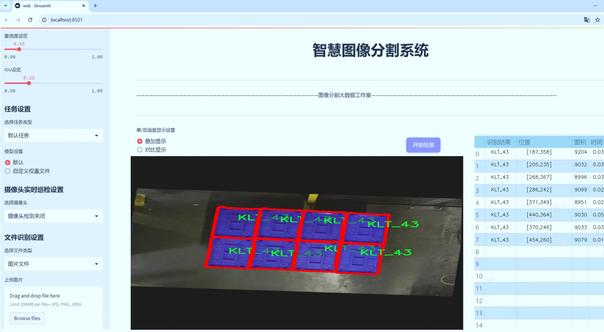
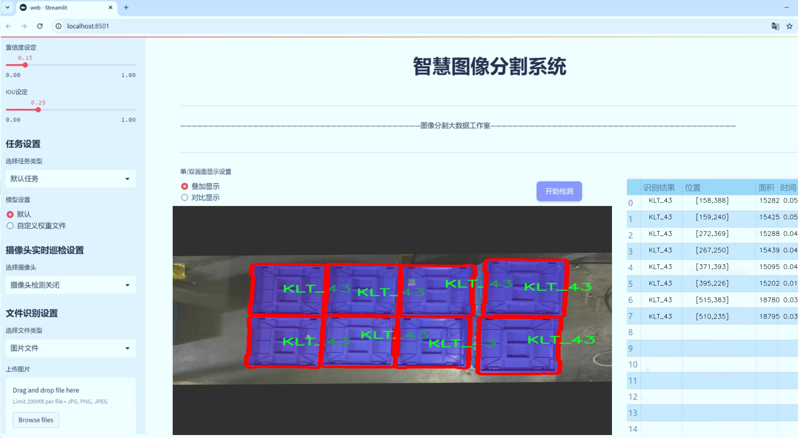
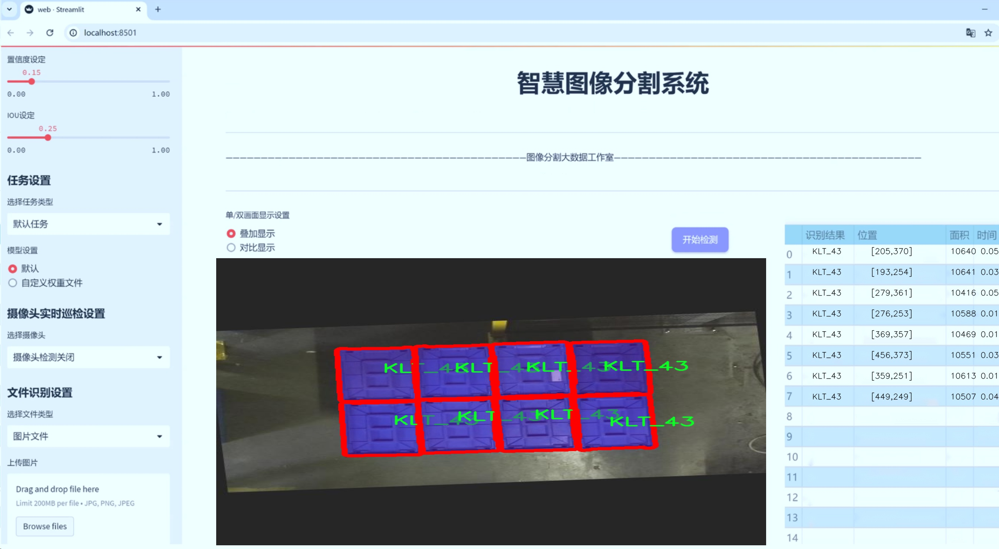
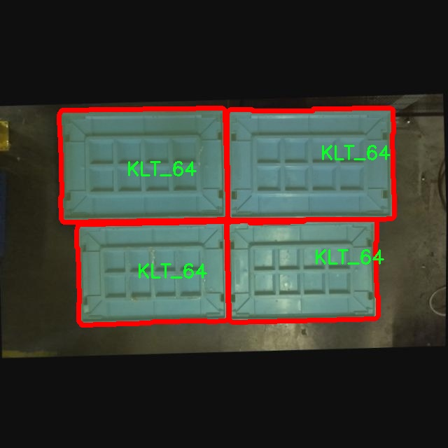
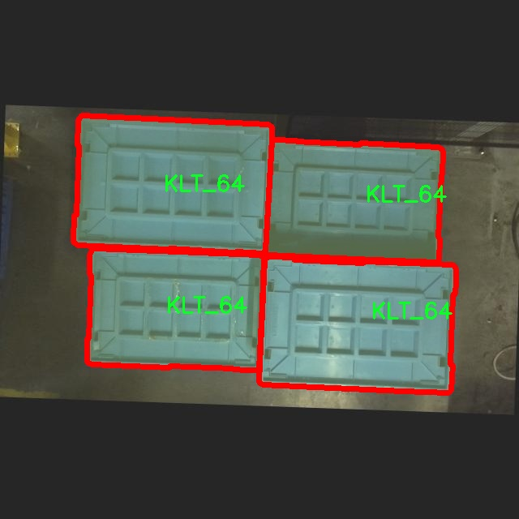
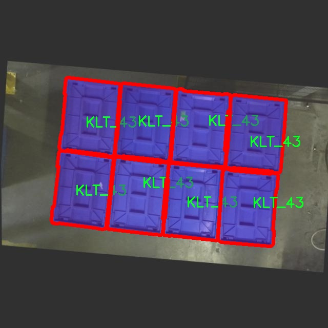
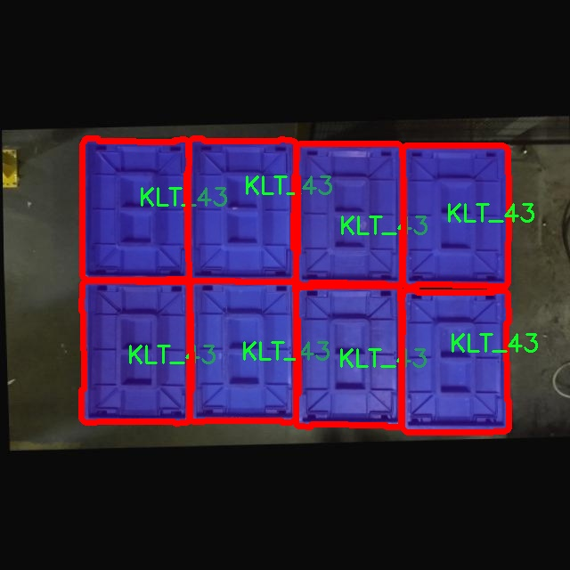
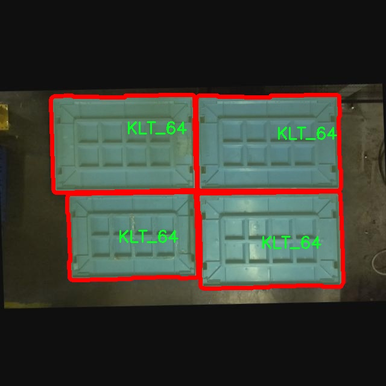

# KLT芯片图像分割系统： yolov8-seg-GhostHGNetV2

### 1.研究背景与意义

[参考博客](https://gitee.com/YOLOv8_YOLOv11_Segmentation_Studio/projects)

[博客来源](https://kdocs.cn/l/cszuIiCKVNis)

研究背景与意义

随着计算机视觉技术的迅猛发展，图像分割作为其核心任务之一，已经在多个领域中展现出重要的应用潜力。尤其是在自动驾驶、医疗影像分析、工业检测等领域，精准的图像分割技术能够显著提升系统的智能化水平和决策能力。近年来，YOLO（You Only Look Once）系列模型因其高效的实时检测能力而受到广泛关注。YOLOv8作为该系列的最新版本，结合了深度学习的最新进展，具备了更强的特征提取能力和更快的处理速度，为图像分割任务提供了新的可能性。

在本研究中，我们提出了一种基于改进YOLOv8的KLT芯片图像分割系统，旨在解决当前图像分割技术在KLT芯片检测中的应用瓶颈。KLT芯片作为一种广泛应用于电子设备中的关键组件，其精确检测与分割对于后续的质量控制和生产流程优化至关重要。通过对1400幅包含三类KLT芯片（KLT_32、KLT_43、KLT_64）的图像进行深度学习训练，我们希望能够构建一个高效、准确的图像分割模型，以满足工业生产中的实际需求。

本研究的意义不仅在于技术层面的创新，更在于其广泛的应用前景。首先，改进YOLOv8模型的引入，使得我们能够在保证分割精度的同时，提升处理速度，这对于实时监控和自动化生产线尤为重要。其次，针对KLT芯片的特定需求，我们设计了专门的数据集，涵盖了多种不同的环境和光照条件，确保模型在实际应用中的鲁棒性。此外，研究中采用的实例分割方法，能够对每个KLT芯片进行独立识别和处理，这在传统的图像分割方法中往往难以实现。

通过对该系统的研究与开发，我们期望能够推动图像分割技术在电子制造领域的应用，为行业提供一种新的解决方案。同时，本研究也为后续的学术研究提供了数据集和模型基础，促进相关领域的深入探索。未来，随着深度学习技术的不断进步和硬件性能的提升，基于YOLOv8的图像分割系统有望在更多的应用场景中发挥重要作用。

综上所述，基于改进YOLOv8的KLT芯片图像分割系统的研究，不仅具有重要的理论价值，也具备广泛的实际应用意义。通过深入探讨该系统的构建与优化，我们希望能够为图像分割技术的发展贡献新的思路与方法，推动智能制造的进程。

### 2.图片演示







注意：本项目提供完整的训练源码数据集和训练教程,由于此博客编辑较早,暂不提供权重文件（best.pt）,需要按照6.训练教程进行训练后实现上图效果。

### 3.视频演示

[3.1 视频演示](https://www.bilibili.com/video/BV17nzXYmEKR/)

### 4.数据集信息

##### 4.1 数据集类别数＆类别名

nc: 2
names: ['KLT_43', 'KLT_64']


##### 4.2 数据集信息简介

数据集信息展示

在本研究中，我们采用了名为“SLC”的数据集，以支持对改进YOLOv8-seg的KLT芯片图像分割系统的训练和验证。该数据集专门设计用于处理KLT芯片图像，具有丰富的样本和多样的场景，旨在提升图像分割的精度和效率。SLC数据集包含两个主要类别，分别为“KLT_43”和“KLT_64”，这两个类别代表了不同型号的KLT芯片，具有各自独特的特征和应用场景。

KLT_43类别的图像样本主要集中在该型号芯片的特定应用环境中，展现了其在实际操作中的表现。这些图像涵盖了多种光照条件、背景复杂度和视角变化，使得模型在训练过程中能够学习到KLT_43芯片的多样性和复杂性。通过对这些图像的细致标注，数据集为YOLOv8-seg模型提供了丰富的训练素材，帮助其在图像分割任务中更好地识别和分离出KLT_43芯片的轮廓。

另一方面，KLT_64类别则代表了另一种型号的KLT芯片，其特征和应用场景与KLT_43有所不同。KLT_64的图像样本同样涵盖了多种环境和条件，确保模型能够适应不同的实际应用需求。通过对KLT_64的图像进行精确标注，数据集为模型提供了必要的训练基础，使其能够有效地进行图像分割，识别出KLT_64芯片的边界和细节。

SLC数据集的构建过程注重数据的多样性和代表性，确保每个类别的样本数量均衡且具有良好的覆盖面。这种设计不仅有助于提高模型的泛化能力，还能有效降低过拟合的风险。数据集中每个类别的样本都经过严格的标注和审核，确保标注的准确性和一致性，从而为模型的训练提供高质量的数据支持。

在图像分割任务中，YOLOv8-seg模型通过对SLC数据集的学习，能够在复杂的图像背景中准确识别出KLT芯片的特征。这一过程不仅依赖于数据集的丰富性和多样性，还需要模型在训练过程中不断优化其参数，以适应不同类别的特征。通过对SLC数据集的深入分析和应用，我们期望能够显著提升KLT芯片图像分割的效果，为相关领域的研究和应用提供更为精准的技术支持。

总之，SLC数据集为改进YOLOv8-seg的KLT芯片图像分割系统提供了坚实的基础。通过对KLT_43和KLT_64两个类别的深入学习，模型将能够在实际应用中展现出更高的分割精度和鲁棒性，为未来的研究和技术发展奠定良好的基础。











### 5.项目依赖环境部署教程（零基础手把手教学）

[5.1 环境部署教程链接（零基础手把手教学）](https://www.bilibili.com/video/BV1jG4Ve4E9t/?vd_source=bc9aec86d164b67a7004b996143742dc)


[5.2 安装Python虚拟环境创建和依赖库安装视频教程链接（零基础手把手教学）](https://www.bilibili.com/video/BV1nA4VeYEze/?vd_source=bc9aec86d164b67a7004b996143742dc)

### 6.手把手YOLOV8-seg训练视频教程（零基础手把手教学）

[6.1 手把手YOLOV8-seg训练视频教程（零基础小白有手就能学会）](https://www.bilibili.com/video/BV1cA4VeYETe/?vd_source=bc9aec86d164b67a7004b996143742dc)


按照上面的训练视频教程链接加载项目提供的数据集，运行train.py即可开始训练



     Epoch   gpu_mem       box       obj       cls    labels  img_size
     1/200     0G   0.01576   0.01955  0.007536        22      1280: 100%|██████████| 849/849 [14:42<00:00,  1.04s/it]
               Class     Images     Labels          P          R     mAP@.5 mAP@.5:.95: 100%|██████████| 213/213 [01:14<00:00,  2.87it/s]
                 all       3395      17314      0.994      0.957      0.0957      0.0843

     Epoch   gpu_mem       box       obj       cls    labels  img_size
     2/200     0G   0.01578   0.01923  0.007006        22      1280: 100%|██████████| 849/849 [14:44<00:00,  1.04s/it]
               Class     Images     Labels          P          R     mAP@.5 mAP@.5:.95: 100%|██████████| 213/213 [01:12<00:00,  2.95it/s]
                 all       3395      17314      0.996      0.956      0.0957      0.0845

     Epoch   gpu_mem       box       obj       cls    labels  img_size
     3/200     0G   0.01561    0.0191  0.006895        27      1280: 100%|██████████| 849/849 [10:56<00:00,  1.29it/s]
               Class     Images     Labels          P          R     mAP@.5 mAP@.5:.95: 100%|███████   | 187/213 [00:52<00:00,  4.04it/s]
                 all       3395      17314      0.996      0.957      0.0957      0.0845


### 7.50+种全套YOLOV8-seg创新点加载调参实验视频教程（一键加载写好的改进模型的配置文件）

[7.1 50+种全套YOLOV8-seg创新点加载调参实验视频教程（一键加载写好的改进模型的配置文件）](https://www.bilibili.com/video/BV1Hw4VePEXv/?vd_source=bc9aec86d164b67a7004b996143742dc)

### YOLOV8-seg算法简介

原始YOLOv8-seg算法原理

YOLOv8-seg算法是由Glenn-Jocher提出的一种新型目标检测与分割算法，作为YOLO系列的最新版本，它在YOLOv3和YOLOv5的基础上进行了多项创新与改进，旨在提升目标检测的精度和速度，尤其是在复杂场景下的表现。YOLOv8-seg不仅保留了YOLO系列一贯的高效性，还引入了更为先进的分割功能，使其在目标检测和实例分割任务中均能表现出色。

首先，YOLOv8-seg在数据预处理阶段延续了YOLOv5的策略，采用了多种数据增强技术以提高模型的鲁棒性和泛化能力。具体而言，算法使用了马赛克增强（Mosaic）、混合增强（Mixup）、空间扰动（Random Perspective）和颜色扰动（HSV Augment）等方法。这些增强手段通过对训练数据进行多样化处理，帮助模型更好地学习到目标的特征，减少过拟合现象，从而提升检测精度。

在骨干网络结构方面，YOLOv8-seg对YOLOv5的设计进行了优化。YOLOv5的主干网络采用了层次分明的C3模块，而YOLOv8-seg则将其替换为新的C2f模块。C2f模块的设计理念在于引入更多的分支，以丰富梯度回传时的支流，从而提高特征提取的效率和准确性。这种结构的改进使得YOLOv8-seg在处理复杂场景时，能够更好地捕捉到多样化的特征信息。

YOLOv8-seg同样采用了特征金字塔网络（FPN）和路径聚合网络（PAN）结构，以实现多尺度信息的充分融合。FPN-PAN结构的设计使得不同尺度的特征能够有效地进行交互，从而增强模型对小目标和大目标的检测能力。在YOLOv8-seg中，C3模块被替换为C2f模块，使得特征融合的过程更加高效，进一步提升了模型的整体性能。

在检测头的设计上，YOLOv8-seg引入了解耦头（Decoupled Head）结构，标志着YOLO系列在检测头设计上的一次重要变革。传统的耦合检测头通过一层卷积同时完成分类和定位任务，而YOLOv8-seg则将这两个任务分开处理，采用两条并行的分支分别提取类别特征和位置特征。这样的设计不仅提高了模型的灵活性，还使得分类和定位的精度得到了显著提升。

在标签分配策略方面，YOLOv8-seg摒弃了依赖于数据集的候选框聚类策略，转而采用了一种动态标签分配策略。这种策略基于TOOD（Task-Oriented Object Detection）方法，通过对目标框和目标分数的动态调整，优化了正负样本的匹配过程。YOLOv8-seg的损失函数主要由类别损失和位置损失两部分组成，其中类别损失采用了变焦损失（Varifocal Loss），而位置损失则结合了CIoU Loss和DFL Loss。这种设计使得模型在训练过程中能够更加关注高质量的正样本，从而提升整体的检测性能。

此外，YOLOv8-seg在实现目标分割的过程中，利用了其独特的网络结构和损失函数设计，使得模型不仅能够识别目标，还能精确地分割出目标的轮廓。这一特性使得YOLOv8-seg在实际应用中具备了更强的实用性，能够满足复杂场景下的目标检测与分割需求。

总的来说，YOLOv8-seg算法通过一系列创新的设计与改进，提升了目标检测与分割的效率和准确性。其在数据预处理、骨干网络、特征融合、检测头设计及标签分配策略等方面的优化，使得YOLOv8-seg成为了一个在实时检测和实例分割领域都具有竞争力的模型。随着YOLOv8-seg的推出，目标检测技术将迎来新的发展机遇，为各类应用场景提供了更为强大的技术支持。


### 9.系统功能展示（检测对象为举例，实际内容以本项目数据集为准）

图9.1.系统支持检测结果表格显示

  图9.2.系统支持置信度和IOU阈值手动调节

  图9.3.系统支持自定义加载权重文件best.pt(需要你通过步骤5中训练获得)

  图9.4.系统支持摄像头实时识别

  图9.5.系统支持图片识别

  图9.6.系统支持视频识别

  图9.7.系统支持识别结果文件自动保存

  图9.8.系统支持Excel导出检测结果数据


### 10.50+种全套YOLOV8-seg创新点原理讲解（非科班也可以轻松写刊发刊，V11版本正在科研待更新）

#### 10.1 由于篇幅限制，每个创新点的具体原理讲解就不一一展开，具体见下列网址中的创新点对应子项目的技术原理博客网址【Blog】：


[10.1 50+种全套YOLOV8-seg创新点原理讲解链接](https://gitee.com/qunmasj/good)

#### 10.2 部分改进模块原理讲解(完整的改进原理见上图和技术博客链接)【如果此小节的图加载失败可以通过CSDN或者Github搜索该博客的标题访问原始博客，原始博客图片显示正常】
### 可变性卷积DCN简介
卷积神经网络由于其构建模块中固定的几何结构，本质上受限于模型几何变换。为了提高卷积神经网络的转换建模能力，《Deformable Convolutional Networks》作者提出了两个模块：可变形卷积（deformable convolution）和可变形RoI池（deformable RoI pooling）。这两个模块均基于用额外的偏移来增加模块中的空间采样位置以及从目标任务中学习偏移的思想，而不需要额外的监督。

第一次证明了在深度神经网络中学习密集空间变换（dense spatial transformation）对于复杂的视觉任务是有效的

视觉识别中的一个关键挑战是如何适应对象比例、姿态、视点和零件变形中的几何变化或模型几何变换。一般有两种方法实现：
1）建立具有足够期望变化的训练数据集。这通常通过增加现有的数据样本来实现，例如通过仿射变换。但是训练成本昂贵而且模型参数庞大。
2）使用变换不变（transformation-invariant）的特征和算法。比如比较有名的SIFT(尺度不变特征变换)便是这一类的代表算法。

但以上的方法有两个缺点：
1）几何变换被假定为固定的和已知的，这些先验知识被用来扩充数据，设计特征和算法。为此，这个假设阻止了对具有未知几何变换的新任务的推广，从而导致这些几何变换可能没有被正确建模。
2）对于不变特征和算法进行手动设计，对于过于复杂的变换可能是困难的或不可行的。

卷积神经网络本质上局限于模拟大型未知转换。局限性源于CNN模块的固定几何结构：卷积单元在固定位置对输入特征图进行采样；池化层以固定比率降低特征矩阵分辨率；RoI（感兴趣区域）池化层将RoI分成固定的空间箱（spatial bins）等。缺乏处理几何变换的内部机制。

这种内部机制的缺乏会导致一些问题，举个例子。同一个CNN层中所有激活单元的感受野大小是相同的，但是这是不可取的。因为不同的位置可能对应于具有不同尺度或变形的对象，所以尺度或感受野大小的自适应确定对于具有精细定位的视觉识别是渴望的。

对于这些问题，作者提出了两个模块提高CNNs对几何变换建模的能力。


deformable convolution（可变形卷积）
将2D偏移量添加到标准卷积中的常规网格采样位置，使得采样网格能够自由变形。通过额外的卷积层，从前面的特征映射中学习偏移。因此，变形采用局部、密集和自适应的方式取决于输入特征。


deformable RoI pooling（可变形RoI池化）
为先前RoI池化的常规库（bin）分区中的每个库位置（bin partition）增加了一个偏移量。类似地，偏移是从前面的特征图和感兴趣区域中学习的，从而能够对具有不同形状的对象进行自适应部件定位（adaptive part localization）。

#### Deformable Convolutional Networks
Deformable Convolution
2D卷积由两个步骤组成：
1）在输入特征图x xx上使用规则网格R RR进行采样。
2）把这些采样点乘不同权重w ww后相加。

网格R定义感受野大小和扩张程度，比如内核大小为3x3，扩张程度为1的网格R可以表示为：
R = { ( − 1 , − 1 ) , ( − 1 , 0 ) , … , ( 0 , 1 ) , ( 1 , 1 ) } R = \{(-1,-1),(-1,0),\dots,(0,1),(1,1)\}
R={(−1,−1),(−1,0),…,(0,1),(1,1)}

​
 一般为小数，使用双线性插值进行处理。（把小数坐标分解到相邻的四个整数坐标点来计算结果）


具体操作如图所示：


首先对输入特征层进行一个普通的3x3卷积处理得到偏移域（offset field）。偏移域特征图具有与输入特征图相同的空间分辨率，channels维度2N对应于N个2D（xy两个方向）偏移。其中的N是原输入特征图上所具有的N个channels，也就是输入输出channels保持不变，这里xy两个channels分别对输出特征图上的一个channels进行偏移。确定采样点后就通过与相对应的权重w点乘相加得到输出特征图上该点最终值。

前面也提到过，由于这里xy两个方向所训练出来的偏移量一般来说是一个小数，那么为了得到这个点所对应的数值，会采用双线性插值的方法，从最近的四个邻近坐标点中计算得到该偏移点的数值，公式如下：


具体推理过程见：双线性插值原理

#### Deformable RoI Poolingb
所有基于区域提议（RPN）的对象检测方法都使用RoI池话处理，将任意大小的输入矩形区域转换为固定大小的特征图。


 一般为小数，需要使用双线性插值进行处理。


具体操作如图所示：


当时看这个部分的时候觉得有些突兀，明明RoI池化会将特征层转化为固定尺寸的区域。其实，我个人觉得，这个部分与上述的可变性卷积操作是类似的。这里同样是使用了一个普通的RoI池化操作，进行一些列处理后得到了一个偏移域特征图，然后重新作用于原来的w × H w \times Hw×H的RoI。只不过这里不再是规律的逐行逐列对每个格子进行池化，而是对于格子进行偏移后再池化处理。

#### Postion﹣Sensitive RoI Pooling
除此之外，论文还提出一种PS RoI池化（Postion﹣Sensitive RoI Pooling）。不同于上述可变形RoI池化中的全连接过程，这里使用全卷积替换。

具体操作如图所示：


首先，对于原来的特征图来说，原本是将输入特征图上的RoI区域分成k × k k\times kk×k个bin。而在这里，则是将输入特征图进行卷积操作，分别得到一个channels为k 2 ( C + 1 ) k^{2}(C+1)k (C+1)的得分图（score maps）和一个channels为2 k 2 ( C + 1 ) 2k{2}(C+1)2k 2 (C+1)的偏移域（offset fields），这两个特征矩阵的宽高是与输入特征矩阵相同的。其中，得分图的channels中，k × k k \times kk×k分别表示的是每一个网格，C CC表示的检测对象的类别数目，1表示背景。而在偏移域中的2表示xy两个方向的偏移。
也就是说，在PS RoI池化中，对于RoI的每一个网格都独自占一个通道形成一层得分图，然后其对于的偏移量占两个通道。offset fields得到的偏移是归一化后的偏移，需要通过和deformable RoI pooling中一样的变换方式得到∆ p i j ∆p_{ij}∆p ij，然后对每层得分图进行偏移池化处理。最后处理完的结果就对应着最后输出的一个网格。所以其包含了位置信息。

原文论述为：


#### Understanding Deformable ConvNets
当可变形卷积叠加时，复合变形的效果是深远的。如图所示：


ps：a是标准卷积的固定感受野，b是可变形卷积的适应性感受野。

感受野和标准卷积中的采样位置在整个顶部特征图上是固定的(左)。在可变形卷积中，它们根据对象的比例和形状进行自适应调整(右)。


### 11.项目核心源码讲解（再也不用担心看不懂代码逻辑）

#### 11.1 ultralytics\models\__init__.py

下面是对给定代码的核心部分进行分析和详细注释的结果：

```python
# Ultralytics YOLO 🚀, AGPL-3.0 license

# 从当前包中导入 RTDETR、SAM 和 YOLO 类
from .rtdetr import RTDETR  # 导入 RTDETR 类，用于实时目标检测
from .sam import SAM        # 导入 SAM 类，可能用于图像分割或其他任务
from .yolo import YOLO      # 导入 YOLO 类，进行目标检测

# 定义模块的公开接口，允许其他模块以更简单的方式导入这些类
__all__ = 'YOLO', 'RTDETR', 'SAM'  # 公开的类列表
```

### 代码分析

1. **导入模块**：
   - `from .rtdetr import RTDETR`：从当前包中导入 `RTDETR` 类，可能是一个用于实时目标检测的实现。
   - `from .sam import SAM`：从当前包中导入 `SAM` 类，可能用于图像分割或其他相关任务。
   - `from .yolo import YOLO`：从当前包中导入 `YOLO` 类，这是一个流行的目标检测算法。

2. **`__all__` 的定义**：
   - `__all__` 是一个特殊变量，用于定义当使用 `from module import *` 时，哪些名称会被导入。这里定义了 `YOLO`、`RTDETR` 和 `SAM` 三个类，意味着这三个类是模块的核心功能部分，其他类或函数不会被导入。

### 总结
这段代码主要用于模块的组织和接口定义，确保在使用该模块时，用户能够方便地访问核心功能类。

这个文件是Ultralytics YOLO项目中的一个初始化文件，位于`ultralytics/models`目录下。文件的主要功能是导入和定义该模块中可用的类或函数，以便其他模块可以更方便地使用。

首先，文件开头的注释表明这是Ultralytics YOLO项目的一部分，并且该项目遵循AGPL-3.0许可证。这是一个开源许可证，允许用户自由使用、修改和分发软件，但要求任何派生作品也必须遵循相同的许可证。

接下来，文件通过相对导入的方式引入了三个模型类：`RTDETR`、`SAM`和`YOLO`。这些类分别定义在同一目录下的不同文件中，可能代表不同的目标检测或分割模型。具体来说：

- `RTDETR`可能是一个基于DETR（Detection Transformer）的实时目标检测模型。
- `SAM`可能是一个分割模型，具体功能需要查看其定义。
- `YOLO`则是著名的“你只看一次”（You Only Look Once）目标检测模型，广泛应用于实时目标检测任务。

最后，`__all__`变量定义了该模块的公共接口，列出了可以通过`from ultralytics.models import *`语句导入的类。这意味着在其他文件中，如果使用这种导入方式，只会导入`YOLO`、`RTDETR`和`SAM`这三个类，而不会导入该模块中可能存在的其他私有类或函数。

总体而言，这个文件的作用是组织和简化模型的导入，使得使用者可以方便地访问和使用这些模型。

#### 11.2 ultralytics\models\sam\build.py

以下是代码中最核心的部分，并附上详细的中文注释：

```python
import torch
from ultralytics.utils.downloads import attempt_download_asset
from .modules.decoders import MaskDecoder
from .modules.encoders import ImageEncoderViT, PromptEncoder
from .modules.sam import Sam
from .modules.tiny_encoder import TinyViT
from .modules.transformer import TwoWayTransformer

def _build_sam(encoder_embed_dim,
               encoder_depth,
               encoder_num_heads,
               encoder_global_attn_indexes,
               checkpoint=None,
               mobile_sam=False):
    """构建所选的SAM模型架构。"""
    
    # 定义提示嵌入维度和图像尺寸
    prompt_embed_dim = 256
    image_size = 1024
    vit_patch_size = 16
    image_embedding_size = image_size // vit_patch_size  # 计算图像嵌入尺寸

    # 根据是否为移动SAM选择不同的图像编码器
    image_encoder = (TinyViT(
        img_size=1024,
        in_chans=3,
        num_classes=1000,
        embed_dims=encoder_embed_dim,
        depths=encoder_depth,
        num_heads=encoder_num_heads,
        window_sizes=[7, 7, 14, 7],
        mlp_ratio=4.0,
        drop_rate=0.0,
        drop_path_rate=0.0,
        use_checkpoint=False,
        mbconv_expand_ratio=4.0,
        local_conv_size=3,
    ) if mobile_sam else ImageEncoderViT(
        depth=encoder_depth,
        embed_dim=encoder_embed_dim,
        img_size=image_size,
        mlp_ratio=4,
        norm_layer=partial(torch.nn.LayerNorm, eps=1e-6),
        num_heads=encoder_num_heads,
        patch_size=vit_patch_size,
        qkv_bias=True,
        use_rel_pos=True,
        global_attn_indexes=encoder_global_attn_indexes,
        window_size=14,
        out_chans=prompt_embed_dim,
    ))

    # 创建SAM模型
    sam = Sam(
        image_encoder=image_encoder,  # 图像编码器
        prompt_encoder=PromptEncoder(
            embed_dim=prompt_embed_dim,
            image_embedding_size=(image_embedding_size, image_embedding_size),
            input_image_size=(image_size, image_size),
            mask_in_chans=16,
        ),
        mask_decoder=MaskDecoder(
            num_multimask_outputs=3,
            transformer=TwoWayTransformer(
                depth=2,
                embedding_dim=prompt_embed_dim,
                mlp_dim=2048,
                num_heads=8,
            ),
            transformer_dim=prompt_embed_dim,
            iou_head_depth=3,
            iou_head_hidden_dim=256,
        ),
        pixel_mean=[123.675, 116.28, 103.53],  # 像素均值
        pixel_std=[58.395, 57.12, 57.375],      # 像素标准差
    )

    # 如果提供了检查点，则加载模型权重
    if checkpoint is not None:
        checkpoint = attempt_download_asset(checkpoint)  # 尝试下载检查点
        with open(checkpoint, 'rb') as f:
            state_dict = torch.load(f)  # 加载权重
        sam.load_state_dict(state_dict)  # 将权重加载到模型中

    sam.eval()  # 设置模型为评估模式
    return sam  # 返回构建的SAM模型
```

### 代码说明：
1. **导入模块**：导入必要的库和模块，包括PyTorch和自定义的模型组件。
2. **_build_sam函数**：这是构建SAM模型的核心函数，接受多个参数以配置模型的不同部分。
   - **参数说明**：
     - `encoder_embed_dim`：编码器的嵌入维度。
     - `encoder_depth`：编码器的深度。
     - `encoder_num_heads`：编码器的头数。
     - `encoder_global_attn_indexes`：全局注意力索引。
     - `checkpoint`：可选的模型检查点，用于加载预训练权重。
     - `mobile_sam`：布尔值，指示是否构建移动版本的SAM。
3. **图像编码器选择**：根据`mobile_sam`的值选择不同的图像编码器（TinyViT或ImageEncoderViT）。
4. **创建SAM模型**：使用指定的编码器和解码器构建SAM模型。
5. **加载检查点**：如果提供了检查点，尝试下载并加载模型权重。
6. **设置评估模式**：将模型设置为评估模式，以便进行推理。

通过这些步骤，代码实现了构建和配置Segment Anything Model (SAM)的功能。

这个程序文件的主要功能是构建不同尺寸的“Segment Anything Model”（SAM）模型，提供了多种构建选项，包括大、中、小型模型以及移动版本的模型。文件中使用了PyTorch库来实现深度学习模型的构建和加载。

首先，文件引入了一些必要的库和模块，包括`torch`和一些自定义的模块，如`MaskDecoder`、`ImageEncoderViT`、`PromptEncoder`、`Sam`、`TinyViT`和`TwoWayTransformer`。这些模块分别负责模型的不同部分，如图像编码、提示编码和掩码解码。

接下来，文件定义了多个构建函数，分别用于构建不同尺寸的SAM模型。这些函数包括`build_sam_vit_h`、`build_sam_vit_l`、`build_sam_vit_b`和`build_mobile_sam`。每个函数调用了一个私有函数`_build_sam`，并传入特定的参数，如编码器的嵌入维度、深度、头数等。这些参数决定了模型的结构和复杂度。

`_build_sam`函数是构建SAM模型的核心函数。它首先定义了一些固定的参数，如提示嵌入维度、图像大小和补丁大小。然后，根据是否构建移动版本的模型，选择合适的图像编码器（`TinyViT`或`ImageEncoderViT`）。接着，创建了SAM模型的实例，包括图像编码器、提示编码器和掩码解码器。掩码解码器中使用了双向变换器（`TwoWayTransformer`）来处理多掩码输出。

如果提供了检查点路径，程序会尝试下载并加载模型的预训练权重。最后，模型被设置为评估模式，并返回构建好的模型实例。

在文件的最后部分，定义了一个字典`samm_model_map`，将模型文件名映射到相应的构建函数。`build_sam`函数根据给定的检查点名称选择合适的构建函数，并返回构建好的模型。如果提供的检查点不在支持的模型列表中，则会抛出一个文件未找到的异常。

总体来说，这个文件的主要目的是提供一种灵活的方式来构建和加载不同配置的SAM模型，以便在图像分割等任务中使用。

#### 11.3 ultralytics\trackers\utils\matching.py

以下是代码中最核心的部分，并附上详细的中文注释：

```python
import numpy as np
import scipy
from scipy.spatial.distance import cdist
from ultralytics.utils.metrics import bbox_ioa

try:
    import lap  # 导入线性分配库
    assert lap.__version__  # 确保导入的包不是目录
except (ImportError, AssertionError, AttributeError):
    from ultralytics.utils.checks import check_requirements
    check_requirements('lapx>=0.5.2')  # 检查并更新到lap包
    import lap


def linear_assignment(cost_matrix, thresh, use_lap=True):
    """
    使用线性分配算法进行匹配。

    参数:
        cost_matrix (np.ndarray): 包含分配成本的矩阵。
        thresh (float): 认为分配有效的阈值。
        use_lap (bool, optional): 是否使用lap.lapjv。默认为True。

    返回:
        (tuple): 包含匹配索引、未匹配的索引（来自'a'）和未匹配的索引（来自'b'）的元组。
    """
    # 如果成本矩阵为空，返回空匹配和所有未匹配索引
    if cost_matrix.size == 0:
        return np.empty((0, 2), dtype=int), tuple(range(cost_matrix.shape[0])), tuple(range(cost_matrix.shape[1]))

    if use_lap:
        # 使用lap库进行线性分配
        _, x, y = lap.lapjv(cost_matrix, extend_cost=True, cost_limit=thresh)
        matches = [[ix, mx] for ix, mx in enumerate(x) if mx >= 0]  # 找到匹配的索引
        unmatched_a = np.where(x < 0)[0]  # 找到未匹配的'a'索引
        unmatched_b = np.where(y < 0)[0]  # 找到未匹配的'b'索引
    else:
        # 使用scipy进行线性分配
        x, y = scipy.optimize.linear_sum_assignment(cost_matrix)  # 行x，列y
        matches = np.asarray([[x[i], y[i]] for i in range(len(x)) if cost_matrix[x[i], y[i]] <= thresh])
        if len(matches) == 0:
            unmatched_a = list(np.arange(cost_matrix.shape[0]))
            unmatched_b = list(np.arange(cost_matrix.shape[1]))
        else:
            unmatched_a = list(set(np.arange(cost_matrix.shape[0])) - set(matches[:, 0]))
            unmatched_b = list(set(np.arange(cost_matrix.shape[1])) - set(matches[:, 1]))

    return matches, unmatched_a, unmatched_b  # 返回匹配结果和未匹配索引


def iou_distance(atracks, btracks):
    """
    基于交并比（IoU）计算轨迹之间的成本。

    参数:
        atracks (list[STrack] | list[np.ndarray]): 轨迹'a'或边界框的列表。
        btracks (list[STrack] | list[np.ndarray]): 轨迹'b'或边界框的列表。

    返回:
        (np.ndarray): 基于IoU计算的成本矩阵。
    """
    # 判断输入类型并获取边界框
    if (len(atracks) > 0 and isinstance(atracks[0], np.ndarray)) \
            or (len(btracks) > 0 and isinstance(btracks[0], np.ndarray)):
        atlbrs = atracks
        btlbrs = btracks
    else:
        atlbrs = [track.tlbr for track in atracks]  # 获取轨迹'a'的边界框
        btlbrs = [track.tlbr for track in btracks]  # 获取轨迹'b'的边界框

    ious = np.zeros((len(atlbrs), len(btlbrs)), dtype=np.float32)  # 初始化IoU矩阵
    if len(atlbrs) and len(btlbrs):
        # 计算IoU
        ious = bbox_ioa(np.ascontiguousarray(atlbrs, dtype=np.float32),
                        np.ascontiguousarray(btlbrs, dtype=np.float32),
                        iou=True)
    return 1 - ious  # 返回成本矩阵（1 - IoU）


def embedding_distance(tracks, detections, metric='cosine'):
    """
    基于嵌入计算轨迹和检测之间的距离。

    参数:
        tracks (list[STrack]): 轨迹列表。
        detections (list[BaseTrack]): 检测列表。
        metric (str, optional): 距离计算的度量。默认为'cosine'。

    返回:
        (np.ndarray): 基于嵌入计算的成本矩阵。
    """
    cost_matrix = np.zeros((len(tracks), len(detections)), dtype=np.float32)  # 初始化成本矩阵
    if cost_matrix.size == 0:
        return cost_matrix  # 如果成本矩阵为空，直接返回

    det_features = np.asarray([track.curr_feat for track in detections], dtype=np.float32)  # 获取检测特征
    track_features = np.asarray([track.smooth_feat for track in tracks], dtype=np.float32)  # 获取轨迹特征
    cost_matrix = np.maximum(0.0, cdist(track_features, det_features, metric))  # 计算距离并确保非负
    return cost_matrix  # 返回成本矩阵


def fuse_score(cost_matrix, detections):
    """
    将成本矩阵与检测分数融合以生成单一相似度矩阵。

    参数:
        cost_matrix (np.ndarray): 包含分配成本的矩阵。
        detections (list[BaseTrack]): 带有分数的检测列表。

    返回:
        (np.ndarray): 融合后的相似度矩阵。
    """
    if cost_matrix.size == 0:
        return cost_matrix  # 如果成本矩阵为空，直接返回

    iou_sim = 1 - cost_matrix  # 将成本矩阵转换为相似度矩阵
    det_scores = np.array([det.score for det in detections])  # 获取检测分数
    det_scores = np.expand_dims(det_scores, axis=0).repeat(cost_matrix.shape[0], axis=0)  # 扩展分数维度
    fuse_sim = iou_sim * det_scores  # 融合相似度
    return 1 - fuse_sim  # 返回融合后的成本矩阵
```

### 代码核心部分解释：
1. **线性分配**：`linear_assignment` 函数使用成本矩阵进行匹配，返回匹配的索引和未匹配的索引。
2. **IoU计算**：`iou_distance` 函数计算轨迹之间的交并比，返回成本矩阵。
3. **嵌入距离**：`embedding_distance` 函数计算轨迹和检测之间的距离，基于特征嵌入。
4. **融合分数**：`fuse_score` 函数将成本矩阵与检测分数结合，生成相似度矩阵。

这个程序文件主要用于处理目标跟踪中的匹配问题，特别是通过计算不同目标之间的成本矩阵来实现目标的关联。文件中包含了多个函数，每个函数都有其特定的功能。

首先，文件导入了必要的库，包括NumPy和SciPy，后者用于计算距离。还尝试导入一个名为`lap`的库，该库用于线性分配，如果导入失败，则会检查并安装相应的依赖。

`linear_assignment`函数是核心函数之一，它接受一个成本矩阵和一个阈值，并根据给定的参数选择使用`lap`库或`scipy`库来执行线性分配。该函数返回匹配的索引、未匹配的索引以及未匹配的目标。若成本矩阵为空，则直接返回空的匹配结果和所有未匹配的索引。

`iou_distance`函数用于计算目标之间的重叠程度，具体是通过计算交并比（IoU）来生成成本矩阵。它接受两个目标列表，判断输入是否为边界框，如果是，则直接使用这些边界框进行计算；否则，从目标中提取边界框。计算完成后，返回的成本矩阵是通过1减去IoU值得到的，表示越高的IoU对应越低的成本。

`embedding_distance`函数则是基于特征嵌入来计算目标与检测之间的距离。它首先初始化一个成本矩阵，然后提取检测的特征，并计算目标的平滑特征与检测特征之间的距离。最终返回的成本矩阵是通过距离计算得到的，使用了指定的距离度量（默认为余弦距离）。

最后，`fuse_score`函数将成本矩阵与检测分数融合，生成一个综合的相似度矩阵。它首先将成本矩阵转换为相似度矩阵，然后将检测分数扩展到与成本矩阵相同的形状，最终计算融合后的相似度矩阵并返回。

总体而言，这个文件实现了目标跟踪中目标匹配的多个关键功能，通过计算不同的成本矩阵和相似度矩阵来提高目标跟踪的准确性和效率。

#### 11.4 ultralytics\nn\backbone\EfficientFormerV2.py

以下是代码中最核心的部分，并附上详细的中文注释：

```python
import torch
import torch.nn as nn
import math
import itertools

class Attention4D(nn.Module):
    def __init__(self, dim=384, key_dim=32, num_heads=8, attn_ratio=4, resolution=7, act_layer=nn.ReLU, stride=None):
        super().__init__()
        self.num_heads = num_heads  # 注意力头的数量
        self.scale = key_dim ** -0.5  # 缩放因子
        self.key_dim = key_dim  # 键的维度
        self.nh_kd = key_dim * num_heads  # 总的键维度

        # 如果有步幅，则调整分辨率和定义卷积层
        if stride is not None:
            self.resolution = math.ceil(resolution / stride)
            self.stride_conv = nn.Sequential(
                nn.Conv2d(dim, dim, kernel_size=3, stride=stride, padding=1, groups=dim),
                nn.BatchNorm2d(dim),
            )
            self.upsample = nn.Upsample(scale_factor=stride, mode='bilinear')
        else:
            self.resolution = resolution
            self.stride_conv = None
            self.upsample = None

        self.N = self.resolution ** 2  # 每个分辨率的总点数
        self.d = int(attn_ratio * key_dim)  # 注意力输出的维度
        self.dh = self.d * num_heads  # 总的输出维度
        self.attn_ratio = attn_ratio  # 注意力比率

        # 定义查询、键、值的卷积层
        self.q = nn.Sequential(nn.Conv2d(dim, self.num_heads * self.key_dim, 1), nn.BatchNorm2d(self.num_heads * self.key_dim))
        self.k = nn.Sequential(nn.Conv2d(dim, self.num_heads * self.key_dim, 1), nn.BatchNorm2d(self.num_heads * self.key_dim))
        self.v = nn.Sequential(nn.Conv2d(dim, self.num_heads * self.d, 1), nn.BatchNorm2d(self.num_heads * self.d))

        # 定义局部值的卷积层
        self.v_local = nn.Sequential(
            nn.Conv2d(self.num_heads * self.d, self.num_heads * self.d, kernel_size=3, stride=1, padding=1, groups=self.num_heads * self.d),
            nn.BatchNorm2d(self.num_heads * self.d),
        )

        # 定义投影层
        self.proj = nn.Sequential(act_layer(), nn.Conv2d(self.dh, dim, 1), nn.BatchNorm2d(dim))

        # 计算注意力偏置
        points = list(itertools.product(range(self.resolution), range(self.resolution)))
        N = len(points)
        attention_offsets = {}
        idxs = []
        for p1 in points:
            for p2 in points:
                offset = (abs(p1[0] - p2[0]), abs(p1[1] - p2[1]))
                if offset not in attention_offsets:
                    attention_offsets[offset] = len(attention_offsets)
                idxs.append(attention_offsets[offset])
        self.attention_biases = nn.Parameter(torch.zeros(num_heads, len(attention_offsets)))  # 注意力偏置参数
        self.register_buffer('attention_bias_idxs', torch.LongTensor(idxs).view(N, N))  # 注册缓冲区

    @torch.no_grad()
    def train(self, mode=True):
        super().train(mode)
        if mode and hasattr(self, 'ab'):
            del self.ab  # 删除临时变量
        else:
            self.ab = self.attention_biases[:, self.attention_bias_idxs]  # 训练模式下的注意力偏置

    def forward(self, x):  # 前向传播
        B, C, H, W = x.shape  # 获取输入的形状
        if self.stride_conv is not None:
            x = self.stride_conv(x)  # 应用步幅卷积

        # 计算查询、键、值
        q = self.q(x).flatten(2).reshape(B, self.num_heads, -1, self.N).permute(0, 1, 3, 2)
        k = self.k(x).flatten(2).reshape(B, self.num_heads, -1, self.N).permute(0, 1, 2, 3)
        v = self.v(x)
        v_local = self.v_local(v)
        v = v.flatten(2).reshape(B, self.num_heads, -1, self.N).permute(0, 1, 3, 2)

        # 计算注意力权重
        attn = (q @ k) * self.scale + (self.attention_biases[:, self.attention_bias_idxs] if self.training else self.ab)
        attn = attn.softmax(dim=-1)  # 应用softmax

        # 计算输出
        x = (attn @ v)
        out = x.transpose(2, 3).reshape(B, self.dh, self.resolution, self.resolution) + v_local
        if self.upsample is not None:
            out = self.upsample(out)  # 上采样

        out = self.proj(out)  # 投影到输出维度
        return out


class EfficientFormerV2(nn.Module):
    def __init__(self, layers, embed_dims=None, mlp_ratios=4, downsamples=None, num_classes=1000):
        super().__init__()
        self.patch_embed = nn.Conv2d(3, embed_dims[0], kernel_size=3, stride=2, padding=1)  # 初始的卷积嵌入层

        network = []
        for i in range(len(layers)):
            # 构建每一层的网络块
            stage = eformer_block(embed_dims[i], i, layers)
            network.append(stage)
            if downsamples[i] or embed_dims[i] != embed_dims[i + 1]:
                network.append(Embedding(patch_size=3, stride=2, in_chans=embed_dims[i], embed_dim=embed_dims[i + 1]))

        self.network = nn.ModuleList(network)  # 将网络块组合成ModuleList

    def forward(self, x):
        x = self.patch_embed(x)  # 通过嵌入层
        for block in self.network:
            x = block(x)  # 通过每个网络块
        return x


def eformer_block(dim, index, layers):
    blocks = []
    for block_idx in range(layers[index]):
        blocks.append(AttnFFN(dim))  # 添加注意力前馈网络
    return nn.Sequential(*blocks)  # 返回一个顺序容器


def efficientformerv2_s0(weights='', **kwargs):
    model = EfficientFormerV2(layers=[2, 2, 6, 4], embed_dims=[32, 48, 96, 176])  # 创建模型
    if weights:
        pretrained_weight = torch.load(weights)['model']
        model.load_state_dict(pretrained_weight)  # 加载预训练权重
    return model

# 其他模型构建函数省略...

if __name__ == '__main__':
    inputs = torch.randn((1, 3, 640, 640))  # 创建输入张量
    model = efficientformerv2_s0()  # 实例化模型
    res = model(inputs)  # 前向传播
    print(res.size())  # 输出结果的形状
```

### 代码核心部分说明：
1. **Attention4D类**：实现了一个四维注意力机制，支持不同的分辨率和步幅，能够计算查询、键、值，并应用注意力机制。
2. **EfficientFormerV2类**：构建了一个高效的变换器模型，包含多个层级的网络块，支持嵌入和下采样。
3. **eformer_block函数**：用于创建特定层数的网络块，主要由注意力前馈网络组成。
4. **efficientformerv2_s0函数**：构建特定配置的EfficientFormerV2模型，并加载预训练权重。

这些部分是实现EfficientFormer的核心，其他部分主要用于配置和初始化模型。

这个程序文件实现了一个名为EfficientFormerV2的深度学习模型，主要用于计算机视觉任务。该模型是EfficientFormer系列的一部分，旨在提高计算效率和准确性。文件中包含多个类和函数，下面是对其主要内容的说明。

首先，文件定义了一些超参数和模型配置，包括不同版本的EfficientFormer的宽度和深度。通过字典`EfficientFormer_width`和`EfficientFormer_depth`，可以根据模型的大小（如S0、S1、S2、L）获取相应的通道数和层数。

接下来，文件定义了多个类，其中最重要的是`EfficientFormerV2`类。该类继承自`nn.Module`，构造函数中初始化了模型的各个部分，包括嵌入层、多个块（由`eformer_block`函数生成）以及可能的下采样层。`forward`方法定义了模型的前向传播过程。

在模型的核心部分，`Attention4D`和`Attention4DDownsample`类实现了四维注意力机制，分别用于处理输入特征和下采样操作。注意力机制是现代深度学习模型中常用的技术，能够帮助模型更好地捕捉输入数据中的重要特征。

`Mlp`类实现了多层感知机（MLP），用于特征的进一步处理。`AttnFFN`和`FFN`类则结合了注意力机制和MLP，形成了完整的前馈网络结构。

此外，文件中还定义了一些辅助函数，例如`update_weight`用于更新模型权重，`efficientformerv2_s0`等函数用于创建不同版本的EfficientFormerV2模型并加载预训练权重。

在文件的最后部分，使用`if __name__ == '__main__':`语句块来测试模型的功能。通过随机生成的输入数据，创建不同版本的EfficientFormerV2模型，并打印出每个模型输出的特征图的尺寸。

总的来说，这个程序文件实现了一个高效的视觉模型，利用了注意力机制和多层感知机，适用于各种计算机视觉任务。通过不同的模型配置，用户可以根据需求选择合适的模型版本。

#### 11.5 ultralytics\nn\autobackend.py

以下是代码中最核心的部分，并附上详细的中文注释：

```python
class AutoBackend(nn.Module):
    """
    处理Ultralytics YOLO模型的动态后端选择，用于推理。
    """

    @torch.no_grad()
    def __init__(self, weights='yolov8n.pt', device=torch.device('cpu'), dnn=False, data=None, fp16=False, fuse=True, verbose=True):
        """
        初始化AutoBackend以进行推理。

        参数:
            weights (str): 模型权重文件的路径，默认为'yolov8n.pt'。
            device (torch.device): 运行模型的设备，默认为CPU。
            dnn (bool): 是否使用OpenCV DNN模块进行ONNX推理，默认为False。
            data (str | Path | optional): 额外的data.yaml文件路径，包含类名，默认为None。
            fp16 (bool): 是否启用半精度推理，仅在特定后端支持，默认为False。
            fuse (bool): 是否融合Conv2D + BatchNorm层以优化，默认为True。
            verbose (bool): 是否启用详细日志，默认为True。
        """
        super().__init__()
        # 处理权重路径和类型
        w = str(weights[0] if isinstance(weights, list) else weights)
        pt, jit, onnx, xml, engine, coreml, saved_model, pb, tflite, edgetpu, tfjs, paddle, ncnn, triton = self._model_type(w)

        # 确定FP16和NHWC格式
        fp16 &= pt or jit or onnx or xml or engine
        nhwc = coreml or saved_model or pb or tflite or edgetpu

        # 设置默认步幅
        stride = 32  
        model, metadata = None, None

        # 设置设备
        cuda = torch.cuda.is_available() and device.type != 'cpu'  # 检查CUDA可用性
        if cuda and not any([nn_module, pt, jit, engine]):  # 如果CUDA可用且不是模型格式
            device = torch.device('cpu')
            cuda = False

        # 如果模型不在本地，则尝试下载
        if not (pt or triton or nn_module):
            w = attempt_download_asset(w)

        # 加载模型
        if nn_module:  # 内存中的PyTorch模型
            model = weights.to(device)
            model = model.fuse(verbose=verbose) if fuse else model
            stride = max(int(model.stride.max()), 32)  # 获取模型步幅
            names = model.module.names if hasattr(model, 'module') else model.names  # 获取类名
            model.half() if fp16 else model.float()
            self.model = model  # 显式分配模型
            pt = True
        elif pt:  # PyTorch模型
            from ultralytics.nn.tasks import attempt_load_weights
            model = attempt_load_weights(weights if isinstance(weights, list) else w, device=device, inplace=True, fuse=fuse)
            stride = max(int(model.stride.max()), 32)
            names = model.module.names if hasattr(model, 'module') else model.names
            model.half() if fp16 else model.float()
            self.model = model
        # 其他模型格式的加载逻辑...
        
        # 检查类名
        if 'names' not in locals():  # 如果类名缺失
            names = self._apply_default_class_names(data)
        names = check_class_names(names)  # 验证类名

        # 禁用梯度
        if pt:
            for p in model.parameters():
                p.requires_grad = False

        self.__dict__.update(locals())  # 将所有局部变量分配给self

    def forward(self, im, augment=False, visualize=False):
        """
        在YOLOv8 MultiBackend模型上运行推理。

        参数:
            im (torch.Tensor): 要进行推理的图像张量。
            augment (bool): 是否在推理期间执行数据增强，默认为False。
            visualize (bool): 是否可视化输出预测，默认为False。

        返回:
            (tuple): 包含原始输出张量和处理后的输出（如果visualize=True）。
        """
        b, ch, h, w = im.shape  # 获取输入图像的形状
        if self.fp16 and im.dtype != torch.float16:
            im = im.half()  # 转换为FP16
        if self.nhwc:
            im = im.permute(0, 2, 3, 1)  # 转换形状

        # 根据模型类型执行推理
        if self.pt or self.nn_module:  # PyTorch
            y = self.model(im, augment=augment, visualize=visualize) if augment or visualize else self.model(im)
        # 其他模型格式的推理逻辑...
        
        # 返回处理后的输出
        return self.from_numpy(y)

    def from_numpy(self, x):
        """
        将numpy数组转换为张量。

        参数:
            x (np.ndarray): 要转换的数组。

        返回:
            (torch.Tensor): 转换后的张量。
        """
        return torch.tensor(x).to(self.device) if isinstance(x, np.ndarray) else x

    @staticmethod
    def _model_type(p='path/to/model.pt'):
        """
        根据模型文件路径返回模型类型。

        参数:
            p: 模型文件的路径，默认为'path/to/model.pt'。
        """
        from ultralytics.engine.exporter import export_formats
        sf = list(export_formats().Suffix)  # 获取支持的后缀
        name = Path(p).name
        types = [s in name for s in sf]  # 检查文件名后缀
        return types  # 返回模型类型
```

### 主要功能概述：
1. **AutoBackend类**：负责动态选择后端以运行YOLO模型的推理。
2. **初始化方法**：加载模型并设置设备、权重、类名等参数。
3. **forward方法**：执行推理，处理输入图像并返回输出。
4. **from_numpy方法**：将numpy数组转换为PyTorch张量。
5. **_model_type静态方法**：根据模型文件路径返回模型类型。

### 重要性：
这段代码的核心在于它为YOLO模型提供了一个灵活的后端支持，使得模型可以在不同的硬件和框架上运行，极大地增强了模型的可用性和适应性。

这个程序文件是Ultralytics YOLO模型的一个重要组成部分，主要负责动态选择后端以运行推理。它支持多种模型格式，包括PyTorch、ONNX、TensorRT等，并提供了一个抽象层，使得在不同平台上部署模型变得更加简单。

文件首先导入了一些必要的库，包括标准库和第三方库，如`torch`、`cv2`、`numpy`等。接着定义了一个`check_class_names`函数，用于检查和转换类名，确保它们符合预期的格式。

`AutoBackend`类是该文件的核心，继承自`torch.nn.Module`。在其构造函数中，接受多个参数，如模型权重路径、设备类型、是否使用DNN模块等。构造函数中通过调用`_model_type`方法来确定模型的类型，并根据不同的模型格式加载相应的模型。

在加载模型时，代码会根据不同的后端格式执行不同的加载逻辑。例如，对于PyTorch模型，使用`attempt_load_weights`函数加载权重；对于ONNX模型，使用OpenCV的DNN模块进行加载；对于TensorRT模型，则使用TensorRT的API进行加载。

在`forward`方法中，模型接收输入图像并执行推理。根据模型的类型，代码会进行不同的处理，比如将输入从PyTorch张量转换为NumPy数组，或者直接调用模型的推理方法。推理结果会根据需要进行后处理，以便于后续的使用。

此外，`warmup`方法用于通过运行一次前向传递来预热模型，以提高后续推理的速度。`_apply_default_class_names`和`_model_type`是静态方法，分别用于应用默认类名和确定模型类型。

总体来说，这个文件实现了一个灵活的后端选择机制，使得用户可以方便地在不同的推理引擎之间切换，从而提升YOLO模型的使用体验。

### 12.系统整体结构（节选）

### 程序整体功能和构架概括

Ultralytics YOLO项目是一个用于目标检测和图像分割的深度学习框架。它的设计目标是提供高效、灵活且易于使用的模型和工具，以便于在各种计算机视觉任务中进行应用。该项目包含多个模块，每个模块负责不同的功能，形成一个完整的工作流。

- **模型定义与构建**：在`ultralytics/models`目录下，模型的定义和构建被组织在不同的文件中，允许用户根据需求选择和构建不同的模型。
- **目标跟踪**：`ultralytics/trackers/utils/matching.py`文件提供了目标匹配的工具，计算不同目标之间的成本矩阵，以提高跟踪的准确性。
- **高效模型**：`ultralytics/nn/backbone/EfficientFormerV2.py`实现了EfficientFormerV2模型，专注于提高计算效率和性能，适用于各种视觉任务。
- **后端选择**：`ultralytics/nn/autobackend.py`文件实现了动态选择推理后端的功能，支持多种模型格式，使得模型部署更加灵活。

### 文件功能整理表

| 文件路径                                         | 功能描述                                                                 |
|--------------------------------------------------|--------------------------------------------------------------------------|
| `ultralytics/models/__init__.py`                | 导入和定义可用的模型类（如YOLO、RTDETR、SAM），简化模块的使用。        |
| `ultralytics/models/sam/build.py`               | 构建不同尺寸的Segment Anything Model（SAM），提供模型初始化和加载功能。 |
| `ultralytics/trackers/utils/matching.py`        | 实现目标跟踪中的匹配功能，计算成本矩阵和相似度矩阵，以提高跟踪准确性。 |
| `ultralytics/nn/backbone/EfficientFormerV2.py`  | 实现EfficientFormerV2模型，提供高效的视觉特征提取和处理能力。        |
| `ultralytics/nn/autobackend.py`                 | 动态选择推理后端，支持多种模型格式（如PyTorch、ONNX、TensorRT），简化推理过程。 |

通过这些模块的协同工作，Ultralytics YOLO项目能够为用户提供一个强大且灵活的计算机视觉解决方案，支持各种应用场景。

### 13.图片、视频、摄像头图像分割Demo(去除WebUI)代码

在这个博客小节中，我们将讨论如何在不使用WebUI的情况下，实现图像分割模型的使用。本项目代码已经优化整合，方便用户将分割功能嵌入自己的项目中。
核心功能包括图片、视频、摄像头图像的分割，ROI区域的轮廓提取、类别分类、周长计算、面积计算、圆度计算以及颜色提取等。
这些功能提供了良好的二次开发基础。

### 核心代码解读

以下是主要代码片段，我们会为每一块代码进行详细的批注解释：

```python
import random
import cv2
import numpy as np
from PIL import ImageFont, ImageDraw, Image
from hashlib import md5
from model import Web_Detector
from chinese_name_list import Label_list

# 根据名称生成颜色
def generate_color_based_on_name(name):
    ......

# 计算多边形面积
def calculate_polygon_area(points):
    return cv2.contourArea(points.astype(np.float32))

...
# 绘制中文标签
def draw_with_chinese(image, text, position, font_size=20, color=(255, 0, 0)):
    image_pil = Image.fromarray(cv2.cvtColor(image, cv2.COLOR_BGR2RGB))
    draw = ImageDraw.Draw(image_pil)
    font = ImageFont.truetype("simsun.ttc", font_size, encoding="unic")
    draw.text(position, text, font=font, fill=color)
    return cv2.cvtColor(np.array(image_pil), cv2.COLOR_RGB2BGR)

# 动态调整参数
def adjust_parameter(image_size, base_size=1000):
    max_size = max(image_size)
    return max_size / base_size

# 绘制检测结果
def draw_detections(image, info, alpha=0.2):
    name, bbox, conf, cls_id, mask = info['class_name'], info['bbox'], info['score'], info['class_id'], info['mask']
    adjust_param = adjust_parameter(image.shape[:2])
    spacing = int(20 * adjust_param)

    if mask is None:
        x1, y1, x2, y2 = bbox
        aim_frame_area = (x2 - x1) * (y2 - y1)
        cv2.rectangle(image, (x1, y1), (x2, y2), color=(0, 0, 255), thickness=int(3 * adjust_param))
        image = draw_with_chinese(image, name, (x1, y1 - int(30 * adjust_param)), font_size=int(35 * adjust_param))
        y_offset = int(50 * adjust_param)  # 类别名称上方绘制，其下方留出空间
    else:
        mask_points = np.concatenate(mask)
        aim_frame_area = calculate_polygon_area(mask_points)
        mask_color = generate_color_based_on_name(name)
        try:
            overlay = image.copy()
            cv2.fillPoly(overlay, [mask_points.astype(np.int32)], mask_color)
            image = cv2.addWeighted(overlay, 0.3, image, 0.7, 0)
            cv2.drawContours(image, [mask_points.astype(np.int32)], -1, (0, 0, 255), thickness=int(8 * adjust_param))

            # 计算面积、周长、圆度
            area = cv2.contourArea(mask_points.astype(np.int32))
            perimeter = cv2.arcLength(mask_points.astype(np.int32), True)
            ......

            # 计算色彩
            mask = np.zeros(image.shape[:2], dtype=np.uint8)
            cv2.drawContours(mask, [mask_points.astype(np.int32)], -1, 255, -1)
            color_points = cv2.findNonZero(mask)
            ......

            # 绘制类别名称
            x, y = np.min(mask_points, axis=0).astype(int)
            image = draw_with_chinese(image, name, (x, y - int(30 * adjust_param)), font_size=int(35 * adjust_param))
            y_offset = int(50 * adjust_param)

            # 绘制面积、周长、圆度和色彩值
            metrics = [("Area", area), ("Perimeter", perimeter), ("Circularity", circularity), ("Color", color_str)]
            for idx, (metric_name, metric_value) in enumerate(metrics):
                ......

    return image, aim_frame_area

# 处理每帧图像
def process_frame(model, image):
    pre_img = model.preprocess(image)
    pred = model.predict(pre_img)
    det = pred[0] if det is not None and len(det)
    if det:
        det_info = model.postprocess(pred)
        for info in det_info:
            image, _ = draw_detections(image, info)
    return image

if __name__ == "__main__":
    cls_name = Label_list
    model = Web_Detector()
    model.load_model("./weights/yolov8s-seg.pt")

    # 摄像头实时处理
    cap = cv2.VideoCapture(0)
    while cap.isOpened():
        ret, frame = cap.read()
        if not ret:
            break
        ......

    # 图片处理
    image_path = './icon/OIP.jpg'
    image = cv2.imread(image_path)
    if image is not None:
        processed_image = process_frame(model, image)
        ......

    # 视频处理
    video_path = ''  # 输入视频的路径
    cap = cv2.VideoCapture(video_path)
    while cap.isOpened():
        ret, frame = cap.read()
        ......
```


### 14.完整训练+Web前端界面+50+种创新点源码、数据集获取


# [下载链接：https://mbd.pub/o/bread/Z5yWm5Zs](https://mbd.pub/o/bread/Z5yWm5Zs)